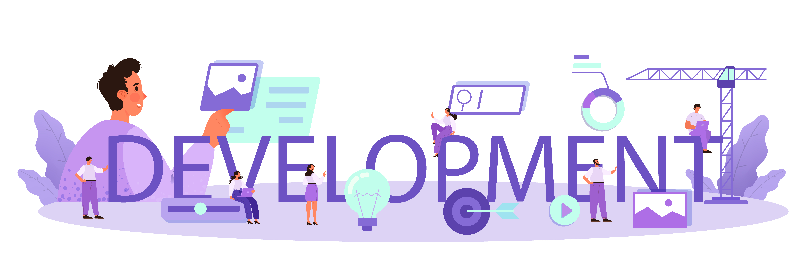

Ali Tarek
=========

<strong>Fullstack Engineer | SaaS Builder | System Architect</strong>

I am **Ali Tarek**, a **fullstack software engineer** with **6+ years of experience** building clean, reliable products across backend systems and modern web applications. I value clarity, maintainability, and strong fundamentals in every project I ship.

I enjoy designing clean architectures, defining service boundaries,
and turning complex ideas into maintainable products.

## About Me

- Location: `Alexandria, Egypt`
- Availability: `Open to interesting engineering opportunities`
- Contact: [`sudoenvx@gmail.com`](mailto:sudoenvx@gmail.com)

## Focus

Full-stack development with `Go`, `Node.js`, `React`, and `Next.js`
Designing scalable APIs and service boundaries
Building accessible and maintainable frontend interfaces
Writing clean, testable, and maintainable systems

## Philosophy

Good software should be simple, observable, and maintainable.
I aim to build systems that are easy to understand, easy to extend,
and reliable in production.

## Skills

- Backend architecture and scalable system design
- Fullstack product delivery from discovery to production
- Service design, API architecture, and integration strategy
- Data modeling, migrations, and performance-aware persistence
- Platform engineering for SaaS workflows and multi-tenant systems
- Designing clean and maintainable codebases

## Engineering Interests

- Distributed systems
- Scalable backend architectures
- SaaS product engineering
- Developer tools and platforms
- Performance and reliability engineering

## Tech Stack

### Frontend Technologies

### Styling and Design

### Backend and APIs

### Tools and DevOps

### Testing and Quality

## GitHub Stats

  
  

<!-- ## Featured Projects
- **Spotify-Style Music Platform**  
  A full music streaming platform with queue management, audio streaming, and scalable backend services.  

  **Tech:** Go, PostgreSQL, Flutter  
  **Focus:** Performance, streaming architecture -->

## Connect

- GitHub: [`github.com/sudoenvx`](https://github.com/sudoenvx)
- LinkedIn: [`linkedin.com/in/sudoenvx/`](https://www.linkedin.com/in/sudoenvx/)
- Email: [`sudoenvx@gmail.com`](mailto:sudoenvx@gmail.com)
- Portfolio: [`sudoenvx.vercel.app`](https://sudoenvx.vercel.app)
